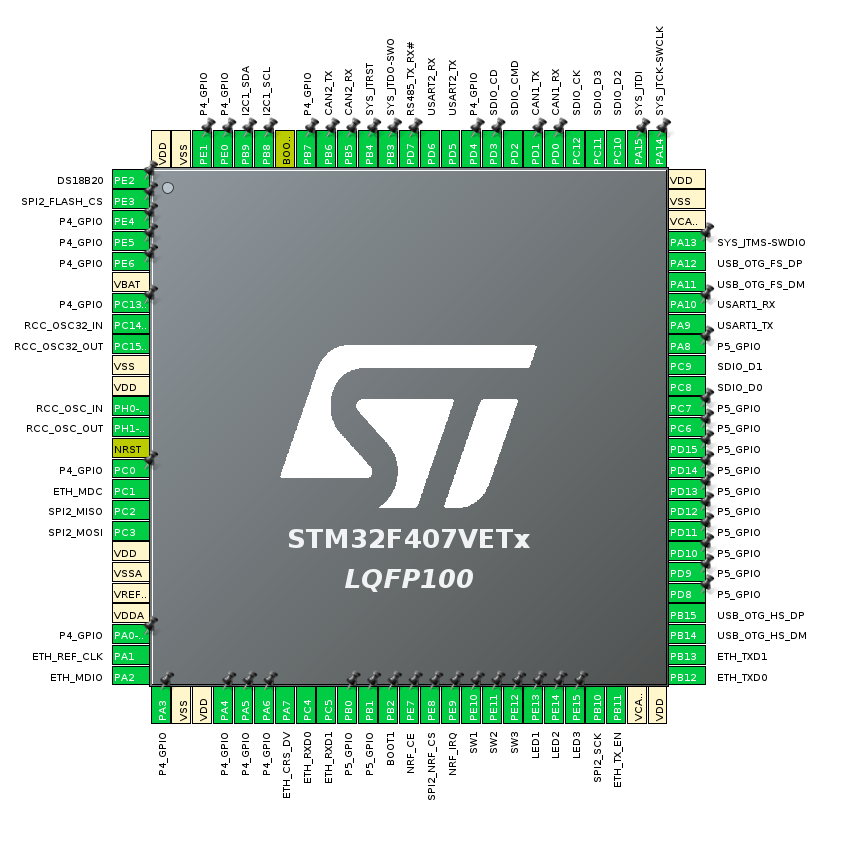

# STM32F407VET6 CCS2 and FoxESS Inverter Controller

## Commands
reset           : Reset the Controller

flash           : Put the Controller into DFU mode

power           : Set the target power (+/- : Discharge / Charge)

hv              : Control the HV test generator
  iso <voltage>     : Set the isolation test voltage (0-500V)
  get               : Triggers a JSON update to measure the HV voltages and HV source current draw
evse            : Control the EVSE (Sink) and CCS2 (Source) parameters
  chg-en 0/1        : Disable / Enable the EVSE CP Line
  pwm 0-100         : Set the CCS2 CP PWM Value
  get               : Trigger a JSON update

led
  user <mask> <set> [flash]
  debug <mask> <set> [flash]

solax           : Solax / FoxESS Inverter Settings
  dc_max_i <current>  : Set the maximum charge and discharge current in A x10
  dc_max_v <voltage>  : Set the maximum battery voltage in V x10
  dc_min_v <voltage>  : Set the minimum battery voltage in V x10
  dc_tgt_v <voltage>  : Set the target battery voltage in V x10
  soc <SoC>           : Set the battery SoC in %
  enable <enable>     : Enable / Disable the Solax BMS emulation

## JSON
typedef enum {
  PP_NONE,     /* Plug not inserted */
  PP_PRESSED,  /* Plug inserted, button pressed */
  PP_INSERTED, /* Plug inserted, not pressed */
  PP_ERROR     /* Invalid reading */
} EVSE_PP;

typedef enum {
  CP_A,        /* No vehicle connected */
  CP_B,        /* Vehicle Connected, not ready */
  CP_C,        /* Vehicle Connected, Charge */
  CP_D,        /* Vehicle Connected, Charge (with ventilation) */
  CP_ERROR     /* Invalid reading */
} CCS2_CP;

typedef enum _solax_state {
  SOLAX_BATTERY_ANNOUNCE,
  SOLAX_REQUEST_CONTACTOR_CLOSE,
  SOLAX_CONTACTOR_PRECHARGE,
  SOLAX_CONTACTOR_CLOSED,
  SOLAX_FAULT,
  SOLAX_UPDATING_FW
} SOLAX_STATE;

{
  controller:{"power_offset":<power in W>, "timestamp":<tick ms>, "acc_current":<mA>, "hv_current":<mA>, "batt_voltage":<Vx10>, "inv_voltage":<Vx10>},
  evse:{"max_current":<A x10>, "pp":<EVSE_PP>, "cp":<CCS2_CP>, "pwm":<ccs2_pwm>},
  solax:{"state":<SOLAX_STATE>, "last_error":<string>, "inv_state":<raw state>, "inv_temp":<Cx10>, "grid_power":<W>, "power_offset":<W>}
}

## STM32F407 Pinout
I have all of the on-board peripherals working. This is the pinout from the main SoC as shown in CubeMX:

## HW Modification Required
The CAN transceiver for CAN1 does not have its ground pin connected. 
You must make a connection from the bottom of C22 to the bottom of C21.

## Building
Install the arm-none-eabi tools.
> apt install gcc-arm-none-eabi  
> make

## Flashing
The STM32F407 has built in DFU functionality. 
Move the BOOT0 jumper from '0' to '1', and connect the mini USB connection to a PC. 

> make flash

Now move the BOOT0 jumper back to '0' and hit reset / power cycle the board.
